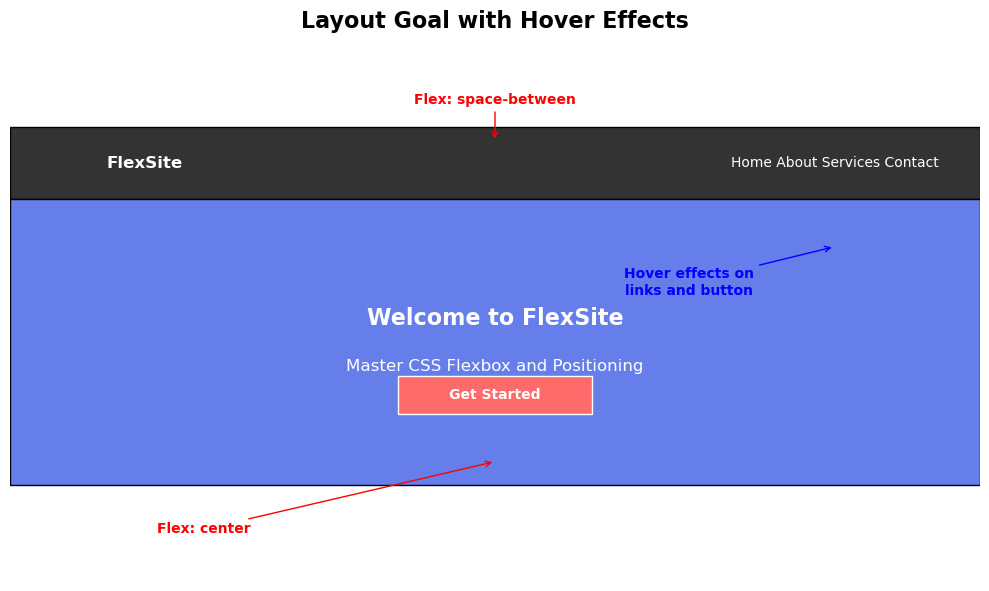

# css-flex-transition

# Learning Target
- I am reviewing flex boxes and transitions

# Success Criteria
- I can use flex container properties to create layouts (display, justify-content, align-items, flex-direction)
- I can apply hover effects to elements
- I can create use transitions to create smooth animations between different states


## Get started
1. Click the Green **Use template** button and create a new repository named *css-practice-flex-transition*
2. Create a new codespace on main
3. Install Live Server and Go Live to view how the webpage looks with no styling
4. Follow directions below under **Your Tasks** to complete this assignment
5. Commit and push, then copy your repository URL to submit on Canvas

## Layout Goal


### Flex Container Properties
```css
container {
    display: flex;
    flex-direction: row | column;
    justify-content: flex-start | flex-end | center | space-around | space-between | space-evenly;
    align-items: flex-start | flex-end | center | stretch;
    flex-wrap: wrap | nowrap;
}
```

### Transitions
```css
selector {
    transition: property duration timing-function;
}

a {
    transition: background-color 1s ease;
}

button {
    transition: all 0.3s ease-in-out;
}
```

# Your Tasks
## Task 1: Navigation Bar
Complete the navigation styling in the designated section of ```styles.css```:

- Make the ```.navbar``` a flex container
- Use ```justify-content:``` ```space-between``` to space logo and links apart
- Make the ```.nav-links``` a flex container with proper spacing between links
- Style the links and logo appropriately

## Task 2: Hover Effects and Transitions
Add hover effects with smooth transitions:

- Add hover effects to the navigation links that change background color
- Add hover effects to the CTA button that change background color
- Use CSS transitions to make the color changes smooth (not instant)
- Make the ```.hero``` a flex container that centers content both horizontally and vertically

## Success Checklist
- [ ] Navigation bar uses display: flex and justify-content: space-between
- [ ] Navigation links are in a horizontal flex container with gaps
- [ ] Navigation links have hover effects with smooth transitions
- [ ] Hero section uses flexbox to center content (justify-content: center and align-items: center)
- [ ] CTA button has hover effects with smooth transitions
- [ ] All transitions are smooth (not instant color changes)
- [ ] Page looks professional and matches the layout diagram